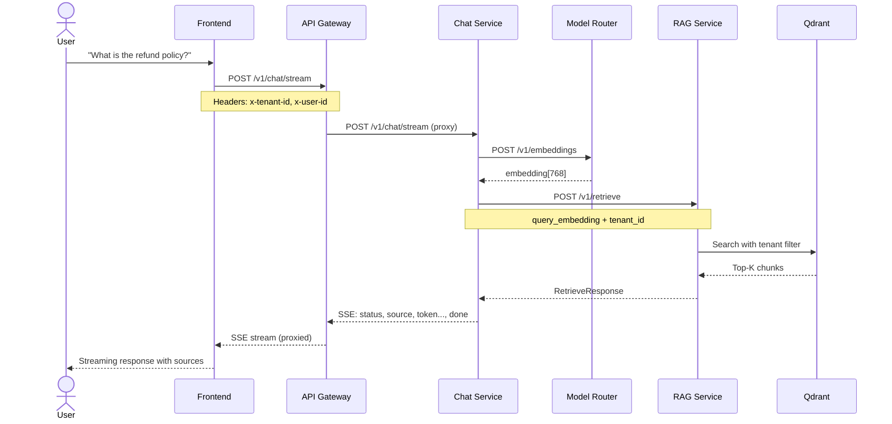
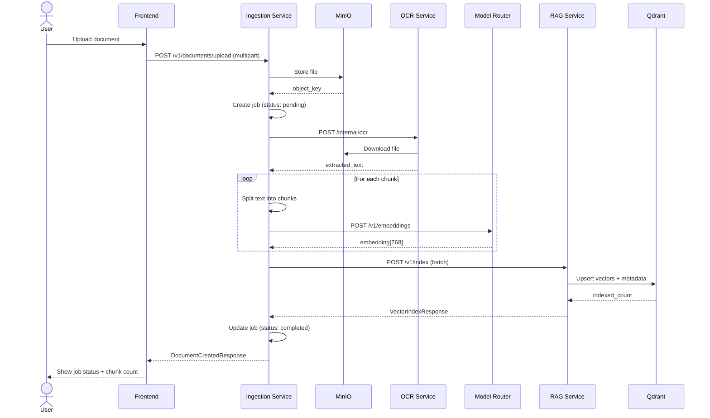
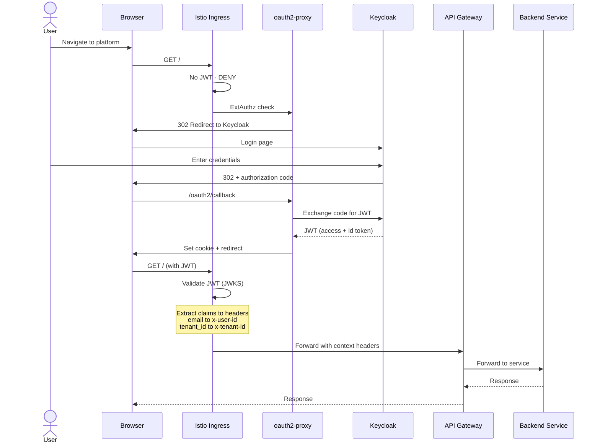
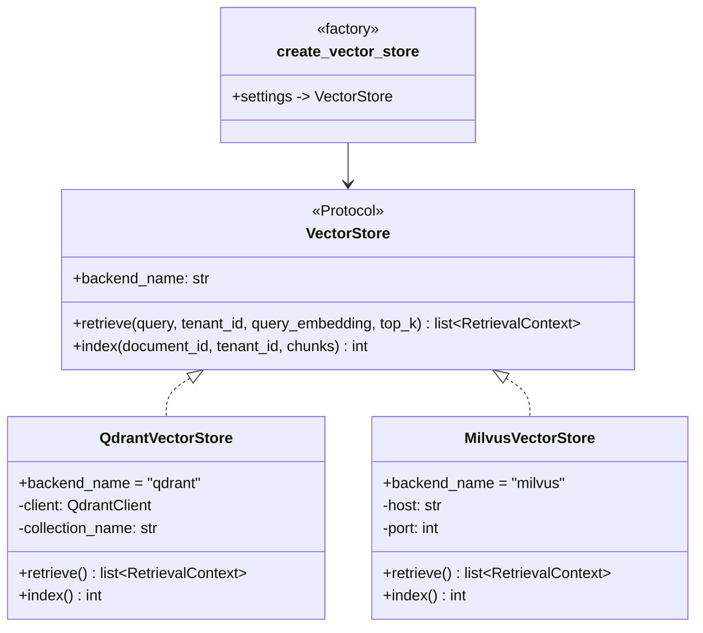
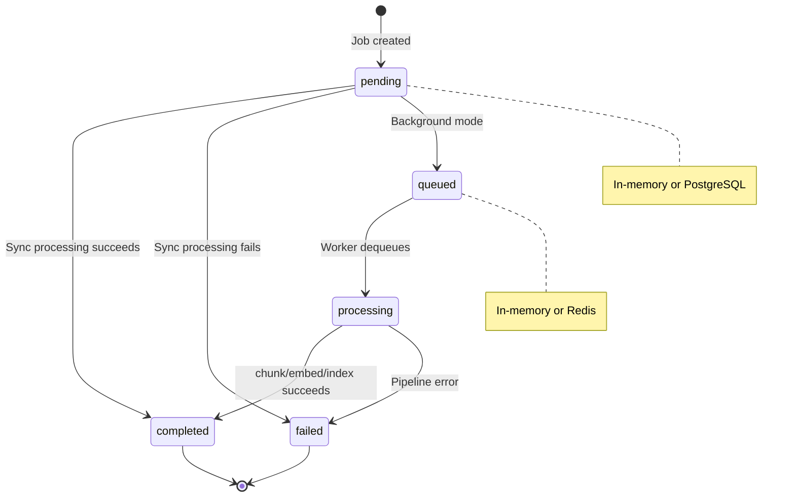

# Architecture Diagrams

A mixture of ASCII art for structural overviews and Mermaid for interactive flows. Mermaid diagrams render natively on GitHub, GitLab, Notion, and most Markdown viewers.

---

## System Overview

```
    +-------------------+
    |     Frontend      |
    |   Next.js :3000   |
    +---------+---------+
              |
    +---------v---------+
    |    API Gateway     |
    |       :8000        |
    +---------+---------+
              |
   +----------+----------+-----------------+
   |          |          |                 |
   v          v          v                 v
+------+  +-------+  +--------+     +---------+
| Chat |  | Ingest|  | Model  |     |  Eval   |
| Svc  |  |  Svc  |  | Router |     |  Svc    |
| :8002|  | :8004 |  | :8006  |     | :8007   |
+--+---+  +--+----+  +---+----+     +---------+
   |         |            |
   |    +----+----+       |
   |    |         |       |
   v    v         v       v
+------+---+  +---+----+ +--------+
| RAG Svc  |  | OCR Svc| | Ollama |
|  :8003   |  | :8005  | | /vLLM  |
+----+-----+  +---+----+ +--------+
     |            |
     v            v
+---------+  +---------+
| Qdrant/ |  | MinIO   |
| Milvus  |  | (S3)    |
+---------+  +---------+

     +----------+  +---------+
     | Postgres |  |  Redis  |
     +----------+  +---------+
```

---

## Service Ports Quick Reference

```
 Service               Port    Role
 ───────────────────────────────────────────
 Frontend              3000    Next.js web app
 API Gateway           8000    Public entrypoint
 Chat Service          8002    Chat + RAG orchestration
 RAG Service           8003    Vector retrieval/indexing
 Ingestion Service     8004    Document pipeline + jobs
 OCR Service           8005    Text extraction
 Model Router          8006    Embedding/generation
 Eval Service          8007    Evaluation suites
```

---

## Chat Flow



---

## Document Ingestion Flow



---

## Inline Text Ingestion (Simplified)

```
 POST /v1/documents        Chunk Text         Embed Chunks        Index Batch         Update Job
 { text: "..." }     -->  (120 words/chunk) --> Model Router  -->  RAG Service  -->  status: completed
                                                /v1/embeddings      /v1/index         indexed_chunks: N
```

---

## Multi-Tenant Data Isolation

```
 +-----------------------+        +-----------------------+
 |      Tenant A         |        |      Tenant B         |
 |     (acme-corp)       |        |     (globex-inc)      |
 +-----------+-----------+        +-----------+-----------+
             |                                |
             v                                v
    +--------+--------+             +--------+--------+
    | RAG: retrieve    |             | RAG: retrieve    |
    | filter:          |             | filter:          |
    | tenant_id =      |             | tenant_id =      |
    |   "acme-corp"    |             |   "globex-inc"   |
    +--------+--------+             +--------+--------+
             |                                |
             v                                v
  +----------+----------+         +-----------+---------+
  | Qdrant vectors      |         | Qdrant vectors      |
  | tenant_id=acme-corp |         | tenant_id=globex-inc|
  +---------------------+         +---------------------+

  Tenant A CANNOT see Tenant B vectors — filtered at the query level.
```

---

## Authentication Flow (Keycloak + Istio)



---

## Kubernetes Deployment Topology

```
 +===========================================================+
 |                    Kubernetes Cluster                       |
 |                                                             |
 |  +--- istio-system ----------------------------------+     |
 |  |  Istio Ingress Gateway                            |     |
 |  |  RequestAuthentication (Keycloak JWT)              |     |
 |  |  AuthorizationPolicy (DENY unauthed + oauth2)      |     |
 |  +---------------------------------------------------+     |
 |         |                                                   |
 |         v                                                   |
 |  +--- enterprise-ai --------------------------------+      |
 |  |                                                   |      |
 |  |  Deployments (x2 replicas each):                  |      |
 |  |    api-gateway        :8000                       |      |
 |  |    chat-service       :8002                       |      |
 |  |    rag-service        :8003                       |      |
 |  |    ingestion-service  :8004                       |      |
 |  |    ocr-service        :8005                       |      |
 |  |    model-router       :8006                       |      |
 |  |    eval-service       :8007                       |      |
 |  |    frontend           :3000                       |      |
 |  |                                                   |      |
 |  |  ConfigMap: ai-platform-config                    |      |
 |  |  Secret:    ai-platform-secrets                   |      |
 |  |  NetworkPolicy: namespace + istio ingress only    |      |
 |  +---------------------------------------------------+      |
 |                                                             |
 |  Overlays:                                                  |
 |    dev     = 1 replica, DEBUG, auth off                     |
 |    staging = 2 replicas, INFO                               |
 |    prod    = 3 replicas, resource limits                    |
 +===========================================================+

         |                              |
    +----v----+                   +-----v-----+
    | Keycloak|                   | Load      |
    | (OIDC)  |                   | Balancer  |
    +---------+                   +-----------+
```

---

## Vector Store Abstraction



---

## Ingestion Job State Machine



---

## Request Context Propagation

```
 Browser
    |
    |  Authorization: Bearer <JWT>
    v
 +--+-----------+
 | Istio /      |   Extract JWT claims:
 | API Gateway  | ─────────────────────────────+
 +--------------+                              |
    |                                          v
    |  x-tenant-id: acme-corp          +--------------+
    |  x-user-id: user@acme.com        | RequestContext|
    |  x-roles: admin,user             |  tenant_id   |
    |  x-request-id: abc-123           |  user_id     |
    v                                  |  roles       |
 +--+-----------+                      |  request_id  |
 | Chat Service | ── forwards ──────>  +--------------+
 +--------------+    same headers            |
    |                                        v
    v                                 All downstream
 +--+-----------+                     services receive
 | RAG Service  |                     the same context
 +--------------+
```

---

## CI/CD Pipeline

```
 Pull Request                                  Main Branch
 ─────────────────────────────────────         ────────────────────
 Push / PR
    |
    +──> [Lint]                                [Coverage Report]
    |     ruff check + format                       ^
    |     mypy type check                           |
    |        |                                      |
    |        v                                      |
    +──> [Test] ────────────────────────────────────+
    |     pytest --cov (60% min)
    |
    +──> [Frontend Lint]
    |     ESLint + tsc --noEmit
    |        |
    |        v
    +──> [Frontend Test]
    |     Vitest
    |
    +──> [Docker Build] ────────────> [Push Images to GHCR]
          8 service images
          (build only on PR,
           push on main)
```
