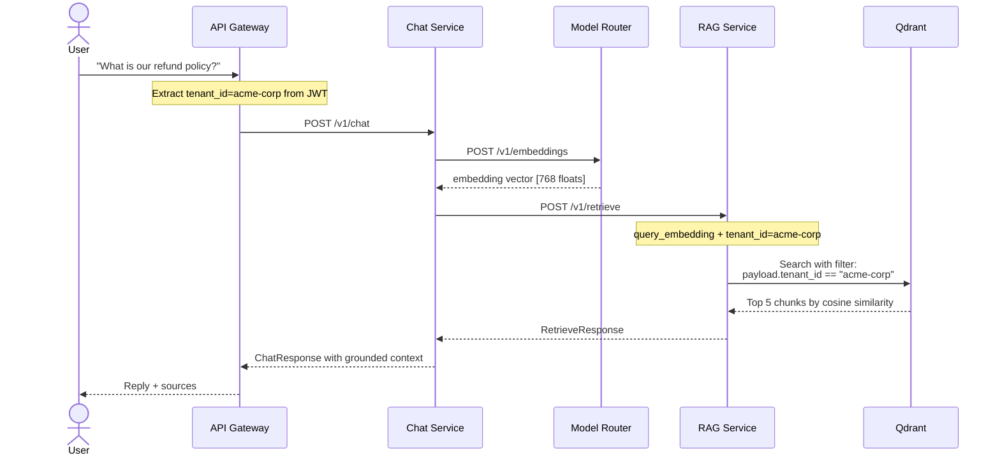
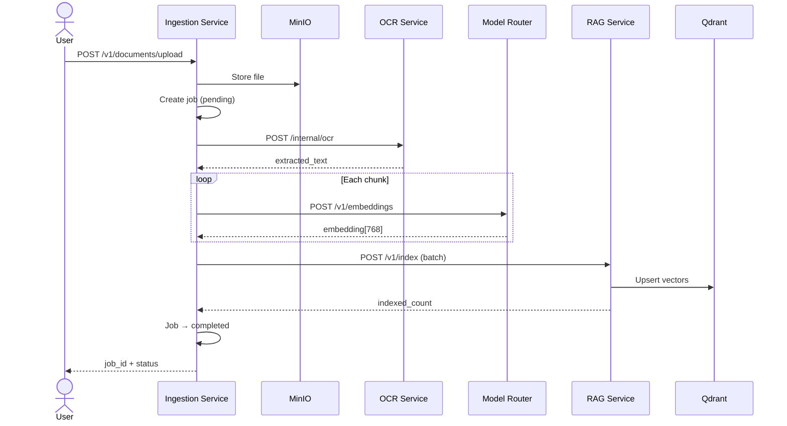

# Building a Private Enterprise AI Platform from Scratch

## Part 2: RAG, Ingestion Pipelines, and Production Hardening

*The internals of vector search, document processing, Keycloak JWT auth, Kubernetes deployment, and Kubeflow integration — the parts that separate a demo from a platform.*

---

In Part 1, we covered the architecture, service boundaries, and local development experience. If you have not read it, the short version is: eight FastAPI microservices, a Next.js frontend, a shared Python library, multi-tenant request context, and a local-first design that boots with Docker Compose.

This article is about everything that makes it work in production.

---

### How RAG Actually Works in This System

Retrieval-Augmented Generation is a simple idea with complex implementation. The idea: before generating a response, search a knowledge base for relevant context and include it in the prompt. The complexity: how do you get documents into that knowledge base, how do you search it efficiently, and how do you keep it multi-tenant?

Here is the complete flow when a user sends a chat message:



The critical detail is the Qdrant query. Every vector in the store carries a `tenant_id` in its payload. When Acme Corp searches their knowledge base, they cannot see documents from other tenants — not because of application logic, but because the vector query itself is filtered.

---

### The Vector Store Abstraction

The RAG Service does not know which vector database it is talking to. It knows the `VectorStore` protocol:

```python
class VectorStore(Protocol):
    backend_name: str

    def retrieve(self, *, query: str, tenant_id: str,
                 query_embedding: list[float] | None,
                 top_k: int) -> list[RetrievalContext]: ...

    def index(self, *, document_id: str, tenant_id: str,
              chunks: list[VectorIndexChunk]) -> int: ...
```

Two implementations exist today:

**QdrantVectorStore** uses the Qdrant Python client. It stores chunks with payload fields for `content`, `source`, `document_id`, and `tenant_id`. Retrieval uses Qdrant's `Filter` with a `FieldCondition` on tenant_id. Indexing uses `upsert` with `PointStruct` objects that carry both the embedding vector and the metadata payload.

**MilvusVectorStore** uses PyMilvus. It maps the same data model to Milvus collections with a `tenant_id` field used in search expressions like `tenant_id == "acme-corp"`.

A factory function selects the backend:

```python
def create_vector_store(settings: AppSettings) -> VectorStore:
    if settings.vector_store_backend == "milvus":
        return MilvusVectorStore(host=settings.milvus_host, port=settings.milvus_port)
    return QdrantVectorStore(host=settings.qdrant_host, port=settings.qdrant_port)
```

Adding a third backend — Pinecone, Weaviate, pgvector — means writing one class that satisfies the protocol. The RAG routes, the chat service, and the ingestion pipeline do not change.

---

### The Ingestion Pipeline: From Text to Searchable Vectors

Ingestion is the most underestimated part of any RAG system. Everyone demos retrieval. Nobody demos the pipeline that got the documents into the vector store in the first place.

Here is what happens when a document enters the system:



For inline text (no file upload), the request looks like:

```
POST /v1/documents
{
  "filename": "refund-policy-2026.pdf",
  "content_type": "application/pdf",
  "text": "Enterprise accounts are eligible for full refunds within 30 days..."
}
Headers: x-tenant-id: acme-corp, x-user-id: admin@acme.com
```

**Step 1: Job creation.** The ingestion service creates a document record and an ingestion job. The job tracks status (`pending`, `completed`, `failed`), the number of indexed chunks, and any error message. The response includes a `job_id` for polling.

```python
job = job_store.create(
    document_id=document_id,
    filename=payload.filename,
    content_type=payload.content_type,
    context=request.state.request_context,
    source_text=payload.text,
)
```

**Step 2: Chunking.** The text is split into chunks. The current implementation uses a simple word-count chunker with configurable size and overlap. This is intentionally naive — the chunking strategy is the single most impactful parameter in RAG quality, and it should be easy to swap.

```python
def chunk_text(text: str, chunk_size: int = 200, overlap: int = 50) -> list[str]:
    words = text.split()
    chunks = []
    start = 0
    while start < len(words):
        end = start + chunk_size
        chunks.append(" ".join(words[start:end]))
        start += chunk_size - overlap
    return chunks
```

**Step 3: Embedding.** Each chunk is sent to the Model Router for embedding:

```python
for i, chunk_text in enumerate(chunks):
    embedding_response = await post_json_model(
        client=client,
        url=f"{settings.model_router_base_url}/v1/embeddings",
        payload=EmbeddingRequest(input=chunk_text),
        response_model=EmbeddingResponse,
        context=context,
    )
    embedded_chunks.append(VectorIndexChunk(
        chunk_id=f"{document_id}-chunk-{i:04d}",
        content=chunk_text,
        source=f"doc://{document_id}/chunk-{i}",
        embedding=embedding_response.embedding,
    ))
```

**Step 4: Indexing.** The embedded chunks are sent to the RAG Service in a single batch:

```python
index_response = await post_json_model(
    client=client,
    url=f"{settings.rag_service_base_url}/v1/index",
    payload=VectorIndexRequest(document_id=document_id, chunks=embedded_chunks),
    response_model=VectorIndexResponse,
    context=context,
)
```

**Step 5: Job completion.** The job status is updated with the count of indexed chunks.

The entire pipeline is explicit. There is no hidden orchestration framework. You can read the workflow module top to bottom and understand exactly what happens to a document.

---

### The Job Store Progression: Memory to Postgres

The ingestion job store follows a pattern we used throughout the platform: **start with an in-memory implementation, then add a durable one behind a configuration flag.**

The in-memory store is a dictionary:

```python
class InMemoryIngestionJobStore:
    def __init__(self) -> None:
        self._jobs: dict[str, IngestionJob] = {}
```

It works perfectly for local development and testing. No database connection needed. No migrations. No pool management. When you are iterating on the chunking strategy, the last thing you want is a PostgreSQL dependency slowing down your feedback loop.

The PostgreSQL store uses the same interface but persists to real tables:

```sql
create table documents (
    document_id text primary key,
    filename text not null,
    content_type text not null,
    created_at timestamptz not null default now()
);

create table ingestion_jobs (
    job_id text primary key,
    document_id text not null references documents(document_id),
    status text not null default 'pending',
    indexed_chunks integer not null default 0,
    error text,
    tenant_id text not null default 'default',
    user_id text not null default 'anonymous',
    source_text text,
    created_at timestamptz not null default now(),
    updated_at timestamptz not null default now()
);
```

Switching is one environment variable:

```env
INGESTION_JOB_STORE_BACKEND=postgres
```

The migration runner tracks which migrations have been applied in a `schema_migrations` table, so re-running is safe:

```bash
uv run python -m ingestion_service.migrations
# → Applied 2 new migration(s).
```

---

### Background Processing: The Worker Contract

Synchronous processing works for small documents. For large-scale ingestion, you need background processing.

The ingestion service supports two processing modes:

- **`sync`** — chunk, embed, and index within the HTTP request
- **`background`** — create the job, enqueue it, and return immediately

In background mode with Redis, the route enqueues a job reference:

```python
queue.enqueue(job_id=job.job_id, document_id=document_id)
```

The worker process dequeues jobs, reloads the persisted job input (including the source text and tenant context), runs the same chunk/embed/index pipeline, and updates the job status:

```python
def process_one(self) -> bool:
    item = self.queue.dequeue()
    if item is None:
        return False

    job = self.job_store.get(job_id=item.job_id)
    # ... run the pipeline ...
    self.job_store.complete(job_id=item.job_id, indexed_chunks=count)
    return True
```

The worker is a standalone loop that can run as a separate process or Kubernetes Deployment. It shares no state with the HTTP service except the job store and the queue.

---

### Security: From Scaffolded to Enforced

The platform has three layers of authentication and authorization.

**Layer 1: JWT validation in the app factory.** When `AUTH_ENABLED=true`, every request must carry a valid JWT from Keycloak. The middleware validates the token against Keycloak's JWKS endpoint (with a 5-minute cache), extracts claims, and populates the request context:

```python
if settings.auth_enabled:
    claims = await validate_jwt_token(request, settings)
    if claims:
        context = RequestContext(
            tenant_id=claims.get("tenant_id", context.tenant_id),
            user_id=claims.get("email", context.user_id),
            roles=claims.get("realm_access", {}).get("roles", context.roles),
            request_id=context.request_id,
        )
```

When auth is disabled (local development), the middleware falls through to header-based context extraction. Same code path, same `RequestContext`, different source of truth.

**Layer 2: Security headers on every response.** The app factory adds `X-Content-Type-Options: nosniff`, `X-Frame-Options: DENY`, `X-XSS-Protection`, `Referrer-Policy`, and `Cache-Control: no-store` — automatically, on every service.

**Layer 3: Istio service mesh (Kubernetes).** When deployed with the Kubeflow integration, Istio's `RequestAuthentication` validates JWTs at the mesh level before they reach any service. An `AuthorizationPolicy` denies unauthenticated requests (except health and metrics endpoints), and oauth2-proxy handles browser-based login flows.

The three layers are independent. You can run locally with no auth, deploy to Kubernetes with JWT validation only, or deploy with full Istio enforcement. Each layer adds security without requiring changes to service code.

---

### Docker: Hardened by Default

Every Dockerfile follows the same hardening pattern:

```dockerfile
FROM python:3.11-slim
COPY --from=ghcr.io/astral-sh/uv:0.9.13 /uv /uvx /bin/
WORKDIR /workspace
ENV UV_LINK_MODE=copy

COPY shared/python-common /workspace/shared/python-common
COPY services/api-gateway /workspace/services/api-gateway
RUN uv pip install --system --no-cache \
    -e /workspace/shared/python-common \
    -e /workspace/services/api-gateway

RUN addgroup --system --gid 1001 appgroup && \
    adduser --system --uid 1001 --ingroup appgroup appuser && \
    chown -R appuser:appgroup /workspace

EXPOSE 8000
HEALTHCHECK --interval=30s --timeout=5s --retries=3 \
    CMD ["python", "-c", "import urllib.request; urllib.request.urlopen('http://localhost:8000/health')"]

WORKDIR /workspace/services/api-gateway
USER appuser
CMD ["uvicorn", "api_gateway.main:app", "--host", "0.0.0.0", "--port", "8000"]
```

Three details matter:

1. **Non-root user.** The process runs as `appuser` (UID 1001). If a vulnerability allows code execution, the attacker has minimal privileges.

2. **Health check.** Docker and Kubernetes both use the health endpoint to determine if the container is alive. No custom scripts.

3. **No cache.** `--no-cache` on pip install means the image does not contain pip's download cache, reducing image size and attack surface.

A `.dockerignore` at the repo root prevents `.git`, `node_modules`, `__pycache__`, `.env`, and test files from being copied into any image.

---

### Kubernetes: Three Environments, One Base

The Kubernetes deployment uses Kustomize with a base and three overlays.

**Base** (`infra/kubernetes/base/`) defines every resource: eight Deployments, eight Services, a ConfigMap, a Secret, and a NetworkPolicy. Every Deployment includes:

- Resource requests (`100m` CPU, `256Mi` memory) and limits (`500m` CPU, `512Mi` memory)
- Liveness probe (30s interval, `/health`)
- Readiness probe (10s interval, `/health`)
- Startup probe (5s interval, 12 retries — gives slow services 60s to start)
- Non-root security context (`runAsUser: 1001`)
- Environment from ConfigMap and Secret

**Dev overlay** scales to 1 replica, sets `LOG_LEVEL=DEBUG`, disables auth, and allows localhost CORS.

**Staging overlay** keeps default replicas and sets `LOG_LEVEL=INFO`.

**Prod overlay** scales to 3 replicas and gives the Model Router more memory (1Gi request, 2Gi limit) for embedding model operations.

```bash
# Deploy to any environment:
kubectl apply -k infra/kubernetes/overlays/dev
kubectl apply -k infra/kubernetes/overlays/staging
kubectl apply -k infra/kubernetes/overlays/prod
```

The NetworkPolicy restricts ingress to the `enterprise-ai` namespace and `istio-system` (for the Istio ingress gateway). Egress allows DNS, intra-namespace traffic, and external services (Keycloak, etc.) while blocking the cloud metadata endpoint.

---

### Kubeflow Integration: Plugging Into an ML Platform

The platform was designed to integrate with [Kubeflow4x Phase-1](https://github.com) — a production Kubeflow deployment with Keycloak SSO, Istio service mesh, and multi-tenant namespace isolation.

The integration lives in `infra/kubeflow-integration/` and provides three things:

**1. Keycloak OIDC client registration** (`keycloak-client.tf`):

A Terraform configuration that creates the AI Platform as an OIDC client in the existing Kubeflow Keycloak realm. It adds a `tenant_id` claim mapper so the JWT carries the user's tenant assignment:

```hcl
resource "keycloak_openid_user_attribute_protocol_mapper" "tenant_id" {
  realm_id         = data.keycloak_realm.kf4x.id
  client_id        = keycloak_openid_client.ai_platform.id
  name             = "tenant-id-mapper"
  user_attribute   = "tenant_id"
  claim_name       = "tenant_id"
  add_to_id_token  = true
  add_to_access_token = true
}
```

**2. Istio authentication and authorization** (`istio-auth.yaml`):

```yaml
apiVersion: security.istio.io/v1beta1
kind: RequestAuthentication
metadata:
  name: ai-platform-keycloak-jwt
spec:
  jwtRules:
    - issuer: "https://keycloak.example.com/realms/kubeflow-4x"
      jwksUri: "https://keycloak.example.com/realms/kubeflow-4x/protocol/openid-connect/certs"
      outputClaimToHeaders:
        - header: x-user-id
          claim: email
        - header: x-tenant-id
          claim: tenant_id
```

Istio extracts JWT claims into the same headers that the app factory reads. The services do not need to know whether auth came from Istio or from the app-level JWT middleware — the `RequestContext` is the same either way.

**3. Traffic routing** (`istio-virtualservice.yaml`):

A `VirtualService` routes `/api/v1/*` to the API Gateway and `/*` to the frontend. A `DestinationRule` configures connection pooling (100 TCP connections, 10 requests per connection).

The result: users log into Kubeflow with their existing Keycloak credentials, and the AI Platform shows up as another application in the same ecosystem — same SSO, same groups, same tenant isolation.

---

### CI/CD: Automated Quality Gates

The GitHub Actions CI pipeline runs on every pull request:

1. **Lint** — ruff check, ruff format, mypy
2. **Test** — pytest with coverage (fails below 60%)
3. **Frontend lint** — ESLint, TypeScript type-check
4. **Frontend test** — Vitest
5. **Docker build** — validates all eight Dockerfiles build successfully

Dependabot monitors four ecosystems (Python, npm, Docker, GitHub Actions) for security updates on a weekly schedule.

Pre-commit hooks catch issues before they reach CI: ruff for lint and formatting, mypy for type safety, and `detect-secrets` to prevent accidental credential commits.

---

### What We Would Do Differently

No architecture survives contact with production unchanged. Here is what we would reconsider:

**Chunking needs more sophistication.** The word-count chunker works, but production RAG quality depends heavily on chunk boundaries respecting document structure — headings, paragraphs, tables. A semantic chunker that understands document layout would meaningfully improve retrieval relevance.

**Streaming should have been day one.** Returning complete JSON responses works, but users expect the typing-indicator experience of streamed responses. Retrofitting SSE or WebSocket streaming into an existing synchronous middleware stack is more work than building it in from the start.

**The eval service needs to be real.** Having the boundary is good, but evaluation should be wired into the development workflow — not a future enhancement. Every change to chunking, embedding, or retrieval should automatically run a quality benchmark.

**OpenTelemetry distributed tracing.** Structured logs with request IDs are good. Proper distributed traces with span trees across all seven services would be better. The request ID propagation is already there — wiring OpenTelemetry would be a natural next step.

---

### Conclusion

Building an enterprise AI platform is not an AI problem. It is a systems engineering problem.

The AI part — embeddings, vector search, prompt composition — is the straightforward part. The hard part is everything around it: multi-tenant data isolation, durable job processing, pluggable infrastructure backends, authentication that works both locally and in production, Kubernetes deployment with proper health checks and resource management, and CI/CD that catches regressions before they ship.

This platform is not the only way to build these things. But it is a complete, working, tested way — one that runs locally in five minutes and deploys to Kubernetes without a rewrite. Every code example in these articles is real, every service has tests, and the architecture is designed to be read by the next engineer who inherits it.

The best infrastructure is the kind you can understand in an afternoon and extend for years.

---

*This is Part 2 of a two-part series. [Part 1](part-1-architecture-and-local-first-design.md) covers the architecture, service design, and local development experience.*

*All code is available in the [Private Enterprise AI Platform](https://github.com) repository. Built with Python 3.11, FastAPI, Next.js 15, PostgreSQL, Redis, Qdrant, Keycloak, and Kubernetes.*
